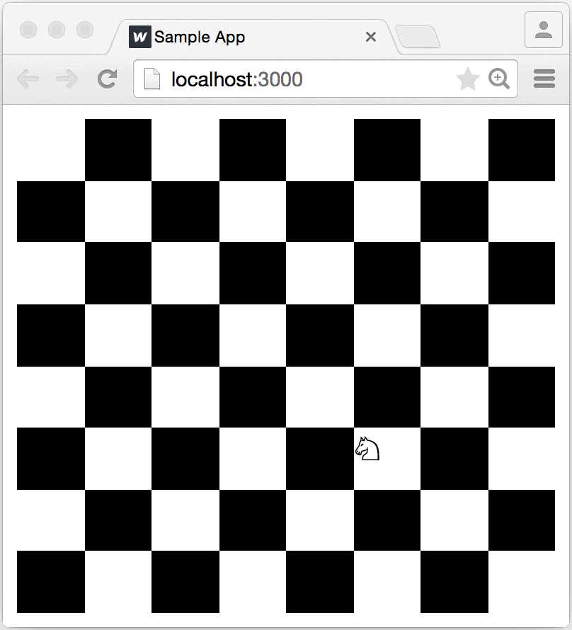
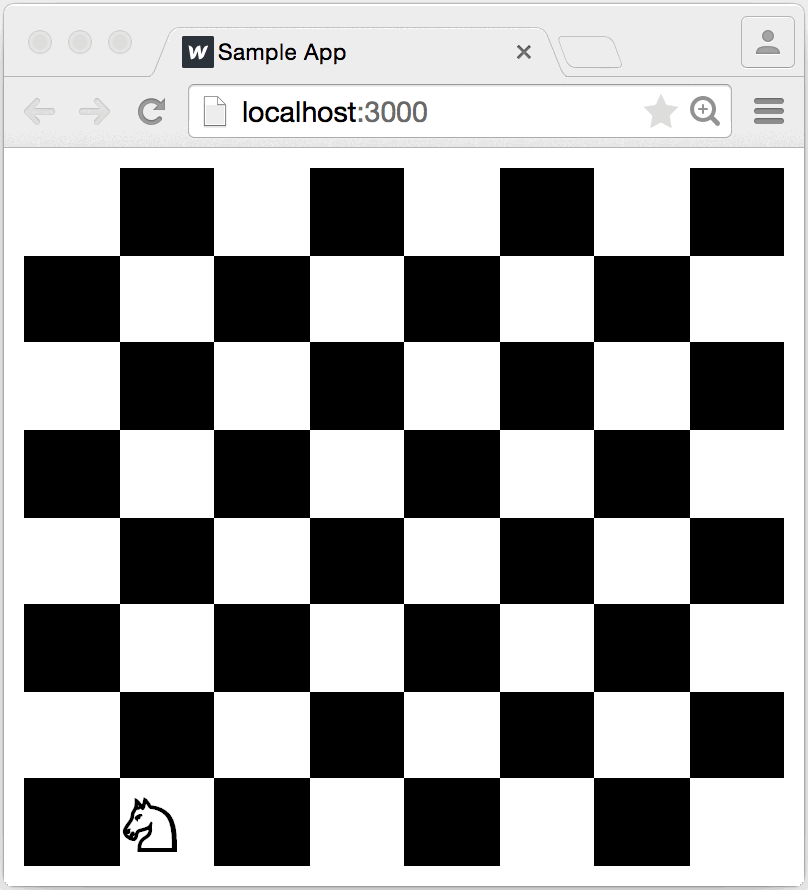
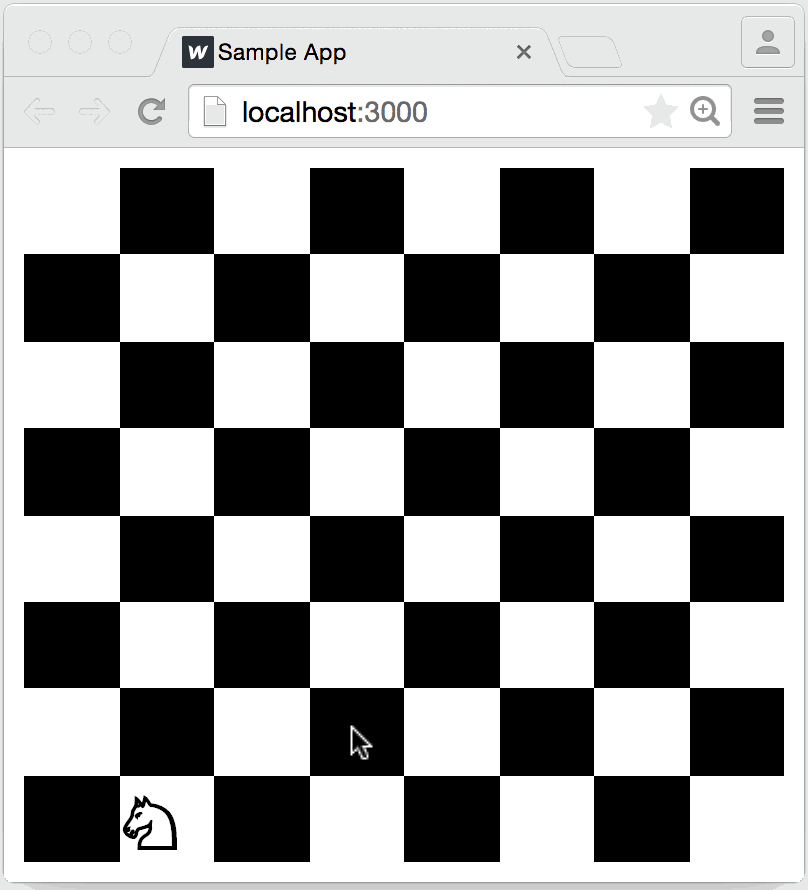
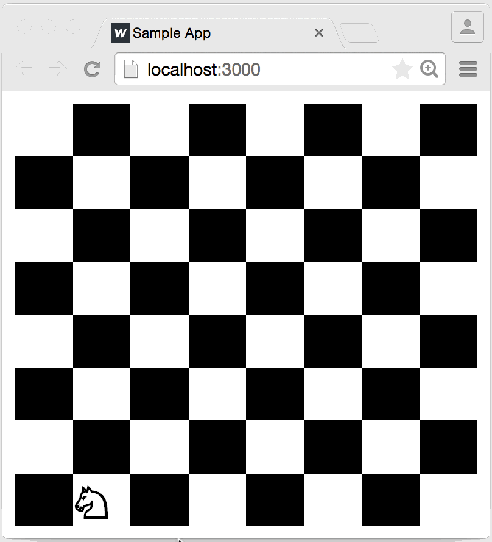

Tutorial: https://react-dnd.github.io/react-dnd/docs/tutorial

想必你已经阅读了概览的章节, 现在开始冒险!


在本章节的教程中, 我们将使用 React 和 React DnD 实现一个国际象棋游戏. 我当然是在开玩笑! 实现一个规则完备的国际象棋游戏需要花费较大的精力, 同时也超出了本教程的教学范畴. 我们需要做的只是一个[简易版的国际象棋游戏, 只有棋盘和一个孤独的骑士](https://react-dnd.github.io/react-dnd/examples/tutorial). 骑士将会是可拖拽的元素.

如果你已经对 React  很熟悉了, 可以直接跳到最后一节的内容: 添加拖拽交互

在本教程的例子中, 会重点关注 `react-dnd` 数据驱动的哲学. 你会学习到如何创建拖拽元素以及拖拽目标, 如何将两者与你的 React 组件关联, 除此之外, 还有如何根据拖拽的事件改变组件的样式.

那么, 现在就开始吧!

# 设置

在本教程中, 代码示例均使用函数组件以及最新的 JavaScript 语法. 因此需要对代码进行编译的处理. 推荐使用: [create-react-app](https://github.com/facebook/create-react-app) 这个脚手架.

本教程所实现的[最终App Demo](https://react-dnd.github.io/react-dnd/examples/tutorial).


# 开始实现游戏

## 声明各个组件

首先开始实现我们的 App 所需要的 React 组件, 暂时不要考虑拖拽的交互. 那么我们的孤单骑士应用, 依赖哪些组件呢? 我列举出了一些: 

- `Knight` :我们的孤单骑士棋子;
- `Square` : 棋盘中的格子;
- `Board`: 含有 64 个格子的棋盘;

然后开始考虑这些组件的属性.

- `Knight` : 不需要任何属性. 它始终身处某个位置. 但是骑士本身不需要知道自己所在位置的具体信息, 因为它始终置于某个棋盘格中.

- `Square` : 或许大家很想要给棋盘格传入位置的属性, 但是实际上它也是不需要这个信息的. 它唯一需要通过属性传入的信息就是棋盘格的颜色. 现在我将 `Square` 的默认颜色值设为白色. 然后为其设置一个属性 black: 它的值是布尔类型. `Square` 接受一个子节点: 当前在其上的棋子. 我选择白色作为默认颜色以匹配浏览器的默认白色.

- `Board` : 这个组件有点奇怪. 将上面的 `Square` 棋盘格组件作为该组件的子组件, 不太符合常理. 不过除了棋盘格, 棋盘中还包含什么呢? 因此, 或许将棋盘格组件作为该组件的子组件可能是合理的. 再仔细想想, 也许骑士组件也是棋盘 `Board` 组件的子组件, 因为骑士组件是置于棋盘上的. 这就意味着, 棋盘组件需要知道骑士当前所在的位置. 在实际的国际象棋游戏中, 应该存在一类数据结构来描述所有棋子, 包括棋子的颜色和位置. 不过我们的应用不需要这么复杂, 只需要有个 `knightPosition` 属性即可. 我们会用一个存在两个元素的数组来描述骑士(也可以说是各个棋盘格)的位置, 例如: `[0 , 0]` 表示的是 A8 位置. 不过为什么是 A8 而不是 A1 呢? 这是为了配合浏览器的坐标方向. 使用 A1 的时候, 我们的坐标系统会变得极其复杂混乱.

接下来的问题是, 当前的状态应该存储在哪里呢? 我不太希望将其放置于 `Board` 组件中. 这里的最佳实践是, 应用依赖的状态, 越小越好, 因为 `Board` 本身已经存在一些位置的逻辑了, 我不希望它再有额外的负担, 还是让其他组件来控制应用的状态吧.

不过好消息是, 现在不需要太在意这些. 我们实现组件的时候, 暂时先假设状态存在于某个位置, 然后确保组件通过属性读取这些状态时渲染正确. 状态管理的问题, 之后再考虑吧!

## 创建组件

在我个人的角度, 更偏爱以自底向上的方式实现应用的功能. 这样的话, 所有新功能的实现都是基于某些功能已实现的前提下的. 如果我先开始实现 `Board` 棋盘组件的话, 那么我就得等到先实现好 `Square` 棋子组件, 这之后才能够看到最终的效果. 而如果是先开始实现 `Square` 棋子组件的话, 则不需要依赖棋盘组件, 就能看到最终效果. 个人认为获取实时反馈是十分重要的. (从我实现的另一个工具: [react-hot-loader](https://gaearon.github.io/react-hot-loader/) 也能看出我这个观点.)

因此现在我要开始实现 `Knight` 骑士组件了. 它不接受任何属性, 实现它最简单的方式是:

```jsx
import React from 'react'

export default function Knight() {
  return <span>♘</span>
}
```
♘  是 Unicode 编码形式的骑士! 这太棒了. 我们能够将颜色作为骑士组件的属性, 但是在我们的实际例子中, 只有白色的骑士, 因此可以直接省略这个属性.

看起来正常渲染了, 为了确保渲染正确, 我会修改所渲染的组件来进行测试:  

```jsx
import React from 'react'
import ReactDOM from 'react-dom'
import Knight from './Knight'

ReactDOM.render(<Knight />, document.getElementById('root'))
```


每创建一个新的组件我都会进行一次同样的操作, 这样我就能够始终看到新组件的渲染效果. 在大型应用中, 我会使用类似 [cosmos](https://github.com/skidding/cosmos)  这类工具来实时观察组件的状态, 这样就能在编写组件时看到实时的反馈.

现在我看到了屏幕上的 `Knight` ! 然后可以开始实现 `Square` 组件了. 这是我的第一步:

```jsx
import React from 'react'

export default function Square({ black }) {
  const fill = black ? 'black' : 'white'
  return <div style={{ backgroundColor: fill }} />
}
```
现在开始修改入口文件的代码来看看骑士组件在棋盘组件内部的效果:

```jsx
import React from 'react'
import ReactDOM from 'react-dom'
import Knight from './Knight'
import Square from './Square'

ReactDOM.render(
  <Square black>
    <Knight />
  </Square>,
  document.getElementById('root')
)
```

然而屏幕却是空的. 因为我犯了几个错误:

- 我不记得给棋盘组件添加宽高的样式了, 因此它并没有在页面中展示出来. 但是我不希望给棋盘组件固定的尺寸, 因此我设置了这样的属性: `width: '100%'` `height: '100%'` 以撑开容器.

- 我还忘了在 `Square` 组件中读取 `{children}`, 因此传入其中的 `Knight` 组件被忽略了.

可是即使我纠正了这两个错误, 依然没有看到我的 `Knight` 组件, 这是因为`Knight` 组件中的文本默认颜色是黑色, 而棋盘格的背景颜色也是黑色. 我们可以给 `Knight` 加上颜色属性来解决这个问题. 不过更加简单的解决方案是在设置 `backgroundColor` 属性的同时也设置关联的 `color` 样式. 这样修改过之后的版本, 就是我们所预期的结果了.

```jsx
import React from 'react'

export default function Square({ black, children }) {
  const fill = black ? 'black' : 'white'
  const stroke = black ? 'white' : 'black'

  return (
    <div
      style={{
        backgroundColor: fill,
        color: stroke,
        width: '100%',
        height: '100%'
      }}
    >
      {children}
    </div>
  )
}
```


现在是时候开始实现 `Board` 棋盘组件了! 最初的版本将会是一个很简单的实现, 只会展示一个棋盘格:

```jsx
import React from 'react'
import Square from './Square'
import Knight from './Knight'

export default function Board() {
  return (
    <div>
      <Square black>
        <Knight />
      </Square>
    </div>
  )
}
```

目前我唯一的目标就是让棋盘组件渲染到页面上, 之后再慢慢对其进行优化:

```jsx
import React from 'react'
import ReactDOM from 'react-dom'
import Board from './Board'

ReactDOM.render(
  <Board knightPosition={[0, 0]} />,
  document.getElementById('root')
)
```
现在已经能看到一个棋盘格在页面中的样子了. 然后要开始加上所有的必要的棋盘格! 可是我还是无从下手. 应该在 `render` 方法中渲染哪些东西呢? `for` 循环某个数据? 还是针对某个数组的 `map` ?

可是我现在暂时不想考虑这些. 我已经知道如何渲染单个棋盘格了, 不管是有骑士或是没有骑士的版本. 通过 `knightPosition` 这个属性, 我还能知道骑士当前的位置. 这意味着我可以开始实现 `renderSquare` (渲染棋盘格) 方法了, 现在先不考虑整个棋盘的渲染, 之后在说.

对于 `renderSquare` 方法, 我的第一想法是: 

```jsx
function renderSquare(x, y, [knightX, knightY]) {
  const black = (x + y) % 2 === 1
  const isKnightHere = knightX === x && knightY === y
  const piece = isKnightHere ? <Knight /> : null

  return <Square black={black}>{piece}</Square>
}
```

可以尝试修改 `Board` 组件, 让它像下面这样渲染:

```jsx
export default function Board({ knightPosition }) {
  return (
    <div
      style={{
        width: '100%',
        height: '100%'
      }}
    >
      {renderSquare(0, 0, knightPosition)}
      {renderSquare(1, 0, knightPosition)}
      {renderSquare(2, 0, knightPosition)}
    </div>
  )
}
```


到目前为止, 我还没有给我的棋盘格进行任何的布局处理. 我会使用 [Flexbox](https://developer.mozilla.org/en-US/docs/Web/CSS/CSS_Flexible_Box_Layout/Basic_Concepts_of_Flexbox) 来实现布局. 在根节点 `div` 中, 我加了点样式, 然后将 `Square` 组件加到了 `div` 中, 这样就能够对它们进行布局. 一般来说, 最好是保持组件被完善地封装, 不要被布局所影响, 因此即使在组件内部添加布局性质的 `div` 也是没有问题的.

```jsx
import React from 'react'
import Square from './Square'
import Knight from './Knight'

function renderSquare(i, [knightX, knightY]) {
  const x = i % 8
  const y = Math.floor(i / 8)
  const isKnightHere = x === knightX && y === knightY
  const black = (x + y) % 2 === 1
  const piece = isKnightHere ? <Knight /> : null

  return (
    <div key={i} style={{ width: '12.5%', height: '12.5%' }}>
      <Square black={black}>{piece}</Square>
    </div>
  )
}

export default function Board({ knightPosition }) {
  const squares = []
  for (let i = 0; i < 64; i++) {
    squares.push(renderSquare(i, knightPosition))
  }

  return (
    <div
      style={{
        width: '100%',
        height: '100%',
        display: 'flex',
        flexWrap: 'wrap'
      }}
    >
      {squares}
    </div>
  )
}
```


现在看起来已经很不错了! 但是我还是不知道如何对 `Board` 进行样式的处理, 使得每一个棋盘格都是正方形, 不过后续添加应该会比较方便.

现在, 我们已经可以修改骑士的位置属性 `knightPosition` 来控制它在棋盘上的位置了:

```jsx
import React from 'react'
import ReactDOM from 'react-dom'
import Board from './Board'

ReactDOM.render(
  <Board knightPosition={[7, 4]} />,
  document.getElementById('root')
)
```


声明式的方式十分令人惊喜! 我想这也是人们喜欢 React 的原因吧.

## 添加状态

接下来就要进行操作让 `Knight` 组件变成可拖拽组件了. 要达到这个目的, 我们需要将当前骑士的位置保存下来, 然后在有需要的时候修改它的位置.

但是这个状态的设计需要仔细的思考,  我们会先开始设计状态, 之后再考虑拖拽的交互. 因此暂时先用简单的点击事件来替代拖拽. 当用户点击某个棋盘格的时候, 骑士会随之移动到该棋盘格, 移动的规则当然需要严格遵循国际象棋的规范. 实现这部分逻辑能够帮助我们深入了解状态的管理, 完成这一步之后只需要将点击的交互改为拖拽的交互就可以了.

React 不会对用户设计状态或数据流的方案有所限制. 用户可以使用 [Flux](https://facebook.github.io/flux/), [Redux](https://github.com/reactjs/react-redux), [Rx](https://github.com/Reactive-Extensions/RxJS) , ~~甚至是 Backbone~~. 不过一定要注意[避免将状态的规模设计地过大](https://martinfowler.com/bliki/CQRS.html).  

我希望这个教程保持简单, 因此不想花费太多时间在安装和配置 Redux 上, 所以在状态管理方面, 会采取尽量简洁的模式. 规模上不像 Redux 那么大 (我们的 App 也没有到必须使用 Redux 来管理状态的地步). 目前我还没有为我的状态管理工具设计好 API, 不过我已经想好了它的名字:  `Game` , 这个工具所必需的一点功能是: 将数据变化的消息通知给我们的 React 代码.

既然有了规划, 我要开始实现我的代码了: `index.js` , 在代码中我会假设 `Game` 的功能已经实现完成. 要注意我们目前的代码还不能够正常执行. 因为我还没想好如何设计我的 API:

```jsx
import React from 'react'
import ReactDOM from 'react-dom'
import Board from './Board'
import { observe } from './Game'

const root = document.getElementById('root')

observe((knightPosition) =>
  ReactDOM.render(<Board knightPosition={knightPosition} />, root)
)
```

我引入的 `observe` 函数是什么呢? 之前提到过我们要实时获取变化的状态, 这个函数能帮助我们达到目的. 我也可以实现一个 `EventEmitter` 来达到同样的目的, 但是这有点大材小用了, 现在我只需要实时关注单个事件的变化, 完全没必要用到 `EventEmitter` . 同时, 我还能将 `Game` 构造为一个对象模型, 可这也是没有必要的, 因为简单的数据类型就能满足我们的需求. 

为了验证订阅的 API 是有效的, 我会先实现一个假的状态管理模块 `Game` , 它会随意生成不同的位置:

```jsx
export function observe(receive) {
  const randPos = () => Math.floor(Math.random() * 8)
  setInterval(() => receive([randPos(), randPos()]), 500)
}
```

现在终于可以回到我们的游戏本身了!



目前达到的效果还不是特别理想. 接下来我希望实现一些联动, 因此需要找到一种方式, 在组件内部修改 `Game` 中所存储的状态. 目前, 我依然希望保持尽可能简单, 因此暴露了 `moveKnight` 方法, 以直接修改内部的状态. 在较为复杂的 app 中, 不同的状态可能会根据不同的用户行为有不同的变化, 因此我们的方式并不适合复杂场景. 但是在我们目前的场景下, 这种方式还是能够满足正常的需求的.

```jsx
let knightPosition = [0, 0]
let observer = null

function emitChange() {
  observer(knightPosition)
}

export function observe(o) {
  if (observer) {
    throw new Error('Multiple observers not implemented.')
  }

  observer = o
  emitChange()
}

export function moveKnight(toX, toY) {
  knightPosition = [toX, toY]
  emitChange()
}
```

现在开始回到我们的组件. 目前我们的目标是, 当某个棋盘格被点击, 将骑士引导到该棋盘格. 一种方式是在棋盘格(`Square`)组件本身调用 `moveKnight` 方法. 不过这就需要我们在调用方法时传入棋盘格当前的位置. 这边有个较为合理的指导方针:  

> 如果一个组件的渲染不需要某些数据, 那么在任何情况下, 该组件都不需要那些数据.

`Square` 组件在渲染时候并不需要知道它的位置信息. 因此我们应该尽量避免将 `moveRight` 方法与 `Square` 组件耦合. 于是我们现在把 `onClick` 处理函数添加给 `div`, 它包裹着 `Square` , 被 `Board` 包裹:

```jsx
import React from 'react'
import Square from './Square'
import Knight from './Knight'
import { moveKnight } from './Game'

/* ... */

function renderSquare(i, knightPosition) {
  /* ... */
  return <div onClick={() => handleSquareClick(x, y)}>{/* ... */}</div>
}

function handleSquareClick(toX, toY) {
  moveKnight(toX, toY)
}
```

实际上, `onClick` 属性还可以添加到 `Square` 组件中, 不过我们最终还是会将点击事件处理器移除, 然后添加上拖拽处理器的, 所以没有必要这样做了.

截止目前, 我们剩下的只有走棋规则的校验了. 骑士不允许任意走到某个棋盘格, [走L字](https://en.wikipedia.org/wiki/Knight_%28chess%29#Movement)是国际象棋的标准规范. 于是我现在开始在 `Game` 中实现 `canMoveKnight(toX, toY)` 方法, 并将初始位置设置为 A2, 以满足国际象棋的规则:

```jsx
let knightPosition = [1, 7]

/* ... */

export function canMoveKnight(toX, toY) {
  const [x, y] = knightPosition
  const dx = toX - x
  const dy = toY - y

  return (
    (Math.abs(dx) === 2 && Math.abs(dy) === 1) ||
    (Math.abs(dx) === 1 && Math.abs(dy) === 2)
  )
}
```

最终, 我在 `handleSquareClick` 方法中, 添加了校验方法:`canMoveKnight` :

```jsx
import { canMoveKnight, moveKnight } from './Game'

/* ... */

function handleSquareClick(toX, toY) {
  if (canMoveKnight(toX, toY)) {
    moveKnight(toX, toY)
  }
}
```


很不错.

实际上, 接下来的这一部分是让我想要编写这份教程的原因. 我们要开始正式进入 React DnD  的世界了, 将拖拽交互与我们的 React 组件进行整合. 

这部分内容假设你已经对[概览](https://react-dnd.github.io/react-dnd/docs/overview)中的内容已经有了初步的了解, 比如说: 底层, 收集函数, 类型, 项目, 拖拽元素, 以及拖拽目标等概念. 如果你对以上概念一无所知, 暂时没有关系, 但是要确保你在代码实现阶段对它们有所了解.

现在我们开始安装 React DnD 和底层的 HTML5 依赖:

```bash
npm install react-dnd react-dnd-html5-backend
```

将来你可能会想要使用其他第三方的底层依赖, 例如: [touch backend](https://www.npmjs.com/package/react-dnd-touch-backend). 不过这部分内容和我们的教程没有太大关系, 就不深入了.

## 设置拖拽上下文

首先需要在我们的 app 中设置 `[DndProvider](https://react-dnd.github.io/react-dnd/docs/api/dnd-provider)` . 它需要包裹在我们组件的最外层. 同时底层依赖也是在此声明的, 本教程中我们使用的是[HTML5Backend](https://react-dnd.github.io/react-dnd/docs/backends/html5).

```jsx
import React from 'react'
import { DndProvider } from 'react-dnd'
import { HTML5Backend } from 'react-dnd-html5-backend'

function Board() {
  /* ... */
  return <DndProvider backend={HTML5Backend}>...</DndProvider>
}
```

## 定义拖拽类型

接下来要创建一个拖拽类型用以描述可拖拽的项目. 在我们目前的 app 中, 只存在一个拖拽类型, 也就是 `KNIGHT` . 我将会创建一个模块 `Constants` , 输出该类型:

```jsx
export const ItemTypes = {
  KNIGHT: 'knight'
}
```

准备工作已经做好了. 现在开始实现 `Knight` 组件的拖拽功能!

## 实现骑士的可拖拽

`[useDrag](https://react-dnd.github.io/react-dnd/docs/api/use-drag)` 钩子函数接受一个有明确结构的对象. 该对象中, `item.type` 的值就是我们刚刚声明的拖拽类型, 然后我们开始实现收集函数.

首先分解步骤:

- `useDrag` 接受有明确结构的对象. `item.type` 是必需的属性, 它声明了可拖拽项目的类型. 这里还可以添加其他信息来完善可拖拽元素的信息. 但是由于我们创建的应用只是教程作用, 因此不再设置其他复杂的属性.

- `collect` 属性表示 *收集函数* : 基本上来说, React DnD 是通过这个方法将拖拽系统中组件的状态信息转换成组件可用的属性的.

- `result array` 包含的内容
    - `props` 对象是这个数组的第一项, 其中包含了用户可以从拖拽系统中获取到的所有属性.
    - *ref* 函数是数组的第二项. 它用以关联 DOM 元素和 react-dnd.

现在我们来看看 `Knight` 组件具体是怎样的, 包括 `useDrag` 函数和 `render` 函数:

```jsx
import React from 'react'
import { ItemTypes } from './Constants'
import { useDrag } from 'react-dnd'

function Knight() {
  const [{isDragging}, drag] = useDrag({
    item: { type: ItemTypes.KNIGHT },
    collect: monitor => ({
      isDragging: !!monitor.isDragging(),
    }),
  })

  return (
    <div
      ref={drag}
      style={{
        opacity: isDragging ? 0.5 : 1,
        fontSize: 25,
        fontWeight: 'bold',
        cursor: 'move',
      }}
    >
      ♘
    </div>,
  )
}

export default Knight
```



`Knight` 现在已经是一个拖拽元素了, 但是目前还没有拖拽目标区域来接受这个元素. 于是我们开始将 `Square` 声明为拖拽目标区域.

不过这次我必须将位置信息传入 `Square` 组件了. 毕竟如果 `Square` 组件不知道自己自己所在的位置, 它就无法知道应该将骑士拖拽到哪个区域. 另一方面,  it still feels wrong because the `Square` as an entity in our application has not changed, and if it used to be simple, why complicate it? When you face this dilemma, it's time to separate the [smart and dumb components](https://medium.com/@dan_abramov/smart-and-dumb-components-7ca2f9a7c7d0).

接下来我要开始添加一个新的组件 `BoardSquare`.  实际上它渲染的是之前的 `Square` ,不过 `BoardSquare` 知道它的位置信息. 同时这个组件还封装了一些逻辑, 这些逻辑在旧的组件 `Board` 中是 `renderSquare` 所作的事情.  这里有一点要注意, 当你用 `renderXXX` 来在某个组件中实现另一个组件时, 就要将 `renderXXX` 中的内容拆分为另一个组件了.

以下是我提取出来的 `BoardSquare` 组件:

```jsx
import React from 'react'
import Square from './Square'

export default function BoardSquare({ x, y, children }) {
  const black = (x + y) % 2 === 1
  return <Square black={black}>{children}</Square>
}
```

I also changed the `Board` to use it:

我还对 `Board` 组件做了一些小改动:

```jsx
/* ... */
import BoardSquare from './BoardSquare'

function renderSquare(i, knightPosition) {
  const x = i % 8
  const y = Math.floor(i / 8)
  return (
    <div key={i} style={{ width: '12.5%', height: '12.5%' }}>
      <BoardSquare x={x} y={y}>
        {renderPiece(x, y, knightPosition)}
      </BoardSquare>
    </div>
  )
}

function renderPiece(x, y, [knightX, knightY]) {
  if (x === knightX && y === knightY) {
    return <Knight />
  }
}
```

现在我们用 `[useDrop](https://react-dnd.github.io/react-dnd/docs/api/use-drop)` 钩子函数来将 `BoardSquare` 组件包装起来. 在该钩子函数中, 我会声明一些可拖拽目标的属性用于处理拖拽事件:

```jsx
const [, drop] = useDrop({
  accept: ItemTypes.KNIGHT,
  drop: () => moveKnight(x, y)
})
```
看到了吗? 在 `drop` 方法中还接受到了 `BoardSquare` 获取的属性, 因此 `drop` 方法知道落棋时骑士应该处于哪个位置. 在实际的 app 中, 我还会用 `monitor.getItem()` 方法来获取被拖拽项目的相关信息 (信息由 `beginDrag` 方法中的拖拽元素返回). 不过目前我们只有一个拖拽元素, 不太需要该方法.

在我的收集器函数中, 会通过监视器函数关注当前处于棋盘格的哪一部分, 以便对棋盘格添加高亮. 

```jsx
const [{ isOver }, drop] = useDrop({
  accept: ItemTypes.KNIGHT,
  drop: () => moveKnight(x, y),
  collect: (monitor) => ({
    isOver: !!monitor.isOver()
  })
})
```
修改 `render` 函数关联可拖拽目标, 并添加高亮之后, 我们的 `BoardSquare` 变成了这样:

```jsx
import React from 'react'
import Square from './Square'
import { canMoveKnight, moveKnight } from './Game'
import { ItemTypes } from './Constants'
import { useDrop } from 'react-dnd'

function BoardSquare({ x, y, children }) {
  const black = (x + y) % 2 === 1
  const [{ isOver }, drop] = useDrop({
    accept: ItemTypes.KNIGHT,
    drop: () => moveKnight(x, y),
    collect: monitor => ({
      isOver: !!monitor.isOver(),
    }),
  })

  return (
    <div
      ref={drop}
      style={{
        position: 'relative',
        width: '100%',
        height: '100%',
      }}
    >
      <Square black={black}>{children}</Square>
      {isOver && (
        <div
          style={{
            position: 'absolute',
            top: 0,
            left: 0,
            height: '100%',
            width: '100%',
            zIndex: 1,
            opacity: 0.5,
            backgroundColor: 'yellow',
          }}
        />
      )}
    </div>,
  )
}

export default BoardSquare
```



我们的 App 看起来功能已经比较完善了! 接下来还有最后一步. 如果棋子被拖拽到不符合要求的区域, 棋盘格要被高亮为红色, 并且不可将骑士放置于该区域. 

通过 React DnD 可以很简单地实现我们的目的, 只需要在拖拽区域的属性中定义 `canDrop` 方法即可:

```jsx
const [{ isOver, canDrop }, drop] = useDrop({
  accept: ItemTypes.KNIGHT,
  canDrop: () => canMoveKnight(x, y),
  drop: () => moveKnight(x, y),
  collect: (monitor) => ({
    isOver: !!monitor.isOver(),
    canDrop: !!monitor.canDrop()
  })
})
```
同时, 在收集器函数中我们再添加 `monitor.canDrop()` 方法, 用以标识区域是否可接受拖拽元素:

```jsx
import React from 'react'
import Square from './Square'
import { canMoveKnight, moveKnight } from './Game'
import { ItemTypes } from './Constants'
import { useDrop } from 'react-dnd'

function BoardSquare({ x, y, children }) {
  const black = (x + y) % 2 === 1
  const [{ isOver, canDrop }, drop] = useDrop({
    accept: ItemTypes.KNIGHT,
    drop: () => moveKnight(x, y),
    canDrop: () => canMoveKnight(x, y),
    collect: (monitor) => ({
      isOver: !!monitor.isOver(),
      canDrop: !!monitor.canDrop()
    })
  })

  return (
    <div
      ref={drop}
      style={{
        position: 'relative',
        width: '100%',
        height: '100%'
      }}
    >
      <Square black={black}>{children}</Square>
      {isOver && !canDrop && <Overlay color="red" />}
      {!isOver && canDrop && <Overlay color="yellow" />}
      {isOver && canDrop && <Overlay color="green" />}
    </div>
  )
}

export default BoardSquare
```



## 添加拖拽预览图

最后一步就是在骑士被拖拽到某个棋盘格之上时, 展示预览图. 尽管浏览器可以对 DOM 节点处理截取屏幕快照. 不过我们希望设置自定义的图片, 应该怎么办呢?

React DnD 内部同样提供了一种方法以实现上述需求, 只需要使用 `useDrag` 钩子函数提供的 preview `ref` 既可:

```jsx
const [{ isDragging }, drag, preview] = useDrag({
  item: { type: ItemTypes.KNIGHT },
  collect: (monitor) => ({
    isDragging: !!monitor.isDragging()
  })
})
```

通过这个属性关联 `render` 方法中的 `dragPreview`, 就能达到目的. 同时 `react-dnd` 还提供了一个工具组件 `DragPreviewImage` 以展示预览图.

本教程通过创建一些 React 组件, 提供组件功能, 状态设计的建议, 然后整合 React  DnD 的拖拽功能, 以达到教学的目的. 教程的目标是传达这两个信息: React DnD 的设计哲学与 React 可以配合得十分默契; 还有一点是, 在实现某些复杂交互之前, 要首先思考 app 的整体结构.

接下来开始享受 DnD 给你带来的拖拽体验吧.

来玩一玩我们的[简易象棋游戏](https://react-dnd.github.io/react-dnd/examples/tutorial)!